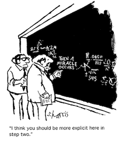
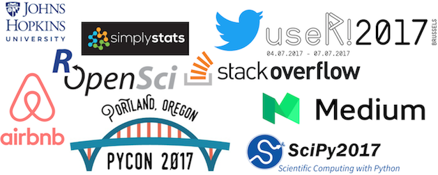

```{r setup, include=FALSE}
knitr::opts_chunk$set(echo = FALSE)
```

## How to build a successful Data Science education program: 
<li style="margin-left: 100px;">teach responsible use of methods, tools and workflows</li>
<li style="margin-left: 100px;">keep the curriculum current and modern</li>
<li style="margin-left: 100px;">build integrated content from the founding fields</li>

<p>
<center>
</br>
<font size="-1">source: [Rich Renomeron](https://flic.kr/p/k4Cwwx) [CC BY-NC-ND](https://creativecommons.org/licenses/by-nc-nd/2.0/)</font>
</center>

## 1. Teach responsible use of Data Science methods, tools and workflows

<li style="margin-left: 100px;">balance the depth and breadth of content to teach</li>
<li style="margin-left: 100px;">teach reproducible Data Science workflows</li>

## 1.1 Balancing the depth and breadth of content to teach

<li style="margin-left: 100px;">teach what is needed for a typical Data Science workflow</li>
<li style="margin-left: 100px;">ensure students have enough knowledge to use in correct context, and to correctly interpret results</li>

<p>
<center>
</br>
</center>

## Typical Data Science workflow is a lot of things!

<p>
<center>
</br>
<font size="-1">source: [R for Data Science](http://r4ds.had.co.nz/introduction.html) by Grolemund & Wickham</font>
</center>

## 1.2 Teach reproducible Data Science workflows

<li style="margin-left: 100px;">reproducible workflows lead to transparency, rigour and believability of Data Science analysis and visualization</li>

<p>
<center>
</br>
<font size="-1">source: [xkcd](https://xkcd.com/)</font>
</center>

## Essential skills for reproducibility

<div class="columns-2">
</br>
<font size="-1">source: [Sidney Harris](http://www.sciencecartoonsplus.com/pages/gallery.php/)</font>

We need to explicitly teach students:
<li>scripting & literate programming</li>
<li>version control</li>
<li>package use & development</li>
<li>package management</li>
<li>environment management</li>
<li>automation</li>
</div>


## 2. Keeping the Data Science curriculum current and modern

<li style="margin-left: 100px;">Data Science in one of the most rapidly evolving fields</li>
<li style="margin-left: 100px;">Instructors need to stay current</li>
<li style="margin-left: 100px;">Students must learn how to stay current too!</li>

## How we can stay current (beyond the literature):
<li style="margin-left: 200px;">Read Data Science, Tech and business blogs</li>
<li style="margin-left: 200px;">Use social media</li>
<li style="margin-left: 200px;">Attend Data Science-related conferences</li>
<li style="margin-left: 200px;">Communicate with Industry</li>
<li style="margin-left: 200px;">Watch what other programs are doing</li>

<p>
<center>

</center>


## 3. Building integrated content from the founding fields of Data Science

<li style="margin-left: 100px;">Data Science education is best created by collaboration</li>
<li style="margin-left: 100px;">Data Science initiatives can benefit supporting departments</li>

<p>
<center>

</center>


## Summary - 3 pillars of Data Science Education

<li style="margin-left: 100px;">teach responsible use of methods, tools and workflows</li>
<li style="margin-left: 100px;">keep the curriculum current and modern</li>
<li style="margin-left: 100px;">build integrated content from the founding fields</li>

<p>
<center>
</br>
<font size="-2">source: [Rich Renomeron](https://flic.kr/p/k4Cwwx) [CC BY-NC-ND](https://creativecommons.org/licenses/by-nc-nd/2.0/)</font>
</center>


# Questions/Discussion